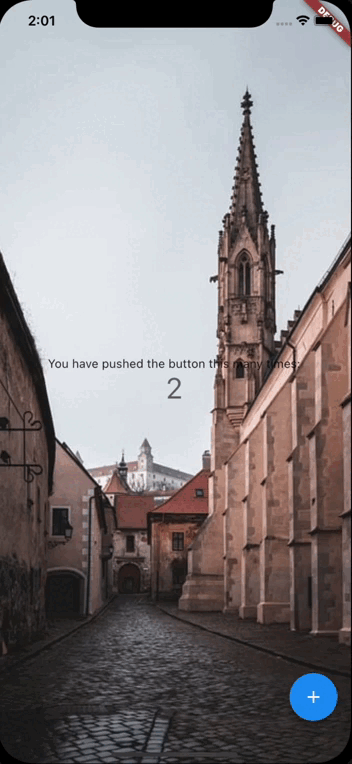

<!--
This README describes the package. If you publish this package to pub.dev,
this README's contents appear on the landing page for your package.

For information about how to write a good package README, see the guide for
[writing package pages](https://dart.dev/guides/libraries/writing-package-pages).

For general information about developing packages, see the Dart guide for
[creating packages](https://dart.dev/guides/libraries/create-library-packages)
and the Flutter guide for
[developing packages and plugins](https://flutter.dev/developing-packages).
-->

TODO: Put a short description of the package here that helps potential users
know whether this package might be useful for them.

## Features
截屏并分享功能



功能不全，后面有时间优化

### 引用的三方库
   + [permission_handler](https://pub.dev/packages/permission_handler)
       - 需要跟进readme 进行配置
   + [path_provider](https://pub.dev/packages/path_provider)


TODO: List what your package can do. Maybe include images, gifs, or videos.

## Getting started

TODO: List prerequisites and provide or point to information on how to
start using the package.

## Usage

TODO: Include short and useful examples for package users. Add longer examples
to `/example` folder.

```dart
 final ShotController shotController = ShotController();

 ScreenShotShare(
        shotController: shotController,
        actionHeight: 100,
        actions: Row(
          mainAxisSize: MainAxisSize.min,
          children: [
            _item('QQ', 'assets/images/ic/ic_news_family_apply.png'),
            _item('微信', 'assets/images/ic/ic_news_feedback.png'),
            _item('小红书', 'assets/images/ic/default_song_cover.png'),
          ],
        ),
        child: SizeBox(),
        )
        
          Widget _item(String title, String iconPath) {
    return Padding(
      padding: const EdgeInsets.symmetric(horizontal: 5),
      child: Column(
        mainAxisSize: MainAxisSize.min,
        children: [
          Image.asset(
            iconPath,
            height: 50,
          ),
          SizedBox(
            height: 5,
          ),
          Text(
            title,
            style: TextStyle(
              fontSize: 10,
              color: Colors.white,
            ),
          )
        ],
      ),
    );
  }
```

## Additional information

TODO: Tell users more about the package: where to find more information, how to
contribute to the package, how to file issues, what response they can expect
from the package authors, and more.
